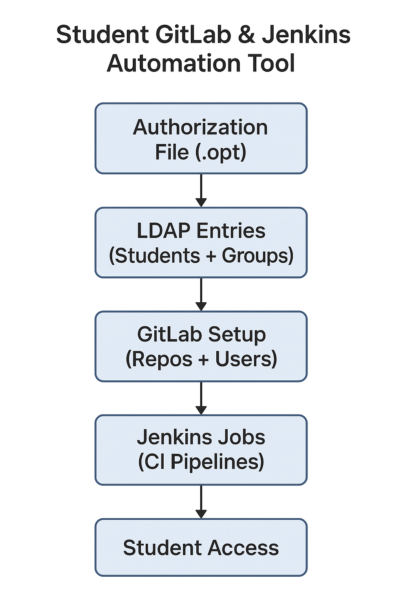

# README

### LDAP based Student GitLab & Jenkins Automation Tool - EasyLab Adminstration

**Lab Supervision for Bachelor Students**\
Monitored and guided laboratory tasks for 4th semester bachelor students, ensuring proper execution of experiments and reinforcing theoretical concepts with hands-on practice.

* Developed a software **LDAP based EasyLab Adminstration Tool** to automate group assignments and monitoring their activities on Jenkins

<figure><figcaption></figcaption></figure>

This LDAP based software written in Python 2.7 automates the setup of student development environments by:

* Creating GitLab repositories for each student based on their **LDAP ID**.
* Assigning GitLab logins.
* Creating Jenkins jobs for continuous integration.

### **1. Install GitLab Runner**

* `curl -L https://packages.gitlab.com/install/repositories/runner/gitlab-runner/script.deb.sh | sudo bash`
* Provide your GitLab URL and "Registration token" during setup. If Gitlab is not set up, please contat IT to provide access of the application through a webserver.
* Once the runner is setup, please start the runner.

### **2. Prepare Configuration**

* Clone the EasyLab-Administration repo with submodules `git clone --recursive` [`https://github.com/parabola-x2/EasyLab-Administration.git`](https://github.com/parabola-x2/EasyLab-Administration.git)
* Go to folder submodules/StudentConfiguration: Copy `authorization_file.opt.orig` → `authorization_file.opt` and add student IDs.
* Go to folder ezslab/: Copy `script-config.opt.orig` → `script-config.opt` and set details of server, password, max-repos etc.



### **3. Run Setup Script**

* `sudo python prepare_lab.py [parameters]`
* `sudo python prepare_lab.py -v ON -l fresh -s -j -g -f authorization-file.opt`

⚙️ Configuration (Prepare or Modify)

* **Prepare**: First-time setup.
* **Modify**: Update existing configuration (e.g., student changes group).

#### Script Parameters

* **Verbose Mode**
  * `-v ON` → verbose enabled (stdout → `logs/`, stderr → console).
  * `-v OFF` → verbose disabled.
* **LDAP Entries**
  * `-l fresh` → delete all students and recreate LDAP entries.
  * `-l incremental` → add/delete individual members only (default).
* **NEW SVN Repositories** (only valid with `-l fresh`).
  * `-s` → delete and recreate SVN repositories
  * Prompts for confirmation and backup.
  * Default: 35 repos (adjustable in `script_config.opt`).
* **NEW Jenkins Jobs** (only valid with `-l fresh`).
  * `-j` → delete and recreate Jenkins jobs
  * Prompts for confirmation and backup.
  * Default: 35 jobs.
* **NEW GitLab Users & Repositories** (only with `-l fresh`).
  * `-g` → delete all repos under namespace `LaborAufgaben` (only with `-l fresh`).
  * Users are not deleted; they simply lose access if unassigned.
  * New users/repos created from `script_config.opt` file.
* **Authorization File (MANDATORY)**
  * `-f` → provide authorization file with all student IDs and groups (mandatory parameter)

### **4. Student Access**

* Jenkins → `https://hostname/jenkins`
* GitLab → `https://hostname/gitlab`
  * `git clone https://username@hostname/gitlab/path_to_the_git_repo`
  * Repository Templates
  * **Template Repo** (`/submodules/template-repo`) → generates lab repos.
  * **Example Repo** (`/submodules/example-repo`) → contains sample code for reference.

### **Repositories and Submodules**

Author: Software has been written by Lecturer M Sc. Vikas Agrawal.

In case of queries, please feel free to contact : vikas.agrawal.de@gmail.com

<table data-view="cards"><thead><tr><th></th><th data-type="content-ref"></th><th data-hidden data-card-cover data-type="image">Cover image</th></tr></thead><tbody><tr><td>EasyLab Adminstration</td><td><a href="https://github.com/parabola-x2/EasyLab-Administration.git">https://github.com/parabola-x2/EasyLab-Administration.git</a></td><td><a href="https://images.unsplash.com/photo-1689236673934-66f8e9d9279b?crop=entropy&#x26;cs=srgb&#x26;fm=jpg&#x26;ixid=M3wxOTcwMjR8MHwxfHNlYXJjaHwxMHx8dGVjaG5pY2FsbGFifGVufDB8fHx8MTc2NTAzODE3Nnww&#x26;ixlib=rb-4.1.0&#x26;q=85">https://images.unsplash.com/photo-1689236673934-66f8e9d9279b?crop=entropy&#x26;cs=srgb&#x26;fm=jpg&#x26;ixid=M3wxOTcwMjR8MHwxfHNlYXJjaHwxMHx8dGVjaG5pY2FsbGFifGVufDB8fHx8MTc2NTAzODE3Nnww&#x26;ixlib=rb-4.1.0&#x26;q=85</a></td></tr></tbody></table>
